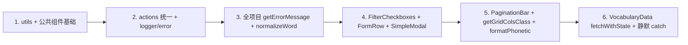

# 6p5-quest 代码质量优化计划（修订）

## 修订概述（本版新增）

- **统一入口**：以 `modules/vocabulary/actions/` 为唯一 Server Actions 入口，删除根目录 `actions.ts`。
- **公共代码**：项目级 `utils/`（error、logger、string：getErrorMessage、normalizeWord、formatPhonetic）；vocabulary 内 VocabularyData 抽 fetchWithState、静默 catch 改为 devError。
- **公共组件**：在 `modules/ui` 抽取 FilterCheckboxes、FormRow、SimpleModal、PaginationBar；getGridColsClass、formatPhonetic 迁到 utils 或 ui 供两模块共用。
- **公共逻辑与领域模型**：公共逻辑见第三节与第四节；领域模型保持 vocabulary / corpus 独立，可选地增加轻量 `IWordDisplay` 供展示层复用。
- **第三方库**：表单可引入 react-hook-form + Zod；表格/列表可按需用 TanStack Table（headless）；弹层保持 daisyUI + SimpleModal。
- **实施阶段**：阶段 1 建 utils + 统一 actions；阶段 2 全项目替换错误/规范化 + VocabularyData 与 catch；阶段 3 公共组件抽取并替换引用。

---

## 一、目标

1. **统一使用 `actions/` 文件夹**：以 `modules/vocabulary/actions/` 为唯一入口，移除根目录 `actions.ts`，避免重复实现与解析歧义。
2. **充分提取公共代码**：将重复的错误处理、日志、字符串规范化等收敛到项目级或模块级共享工具，减少重复、便于维护。

---

## 二、统一使用 actions 文件夹

### 2.1 现状

- 存在 [modules/vocabulary/actions.ts](modules/vocabulary/actions.ts)（约 1652 行）与 [modules/vocabulary/actions/](modules/vocabulary/actions/) 两套实现。
- `actions/` 已具备完整能力：`helpers.ts`（parse\*Json、normalizeMorphemeText）、`filter.ts`、`crud.ts`、`import.ts`、`ai.ts`，且 [actions/index.ts](modules/vocabulary/actions/index.ts) 已对外导出与 `actions.ts` 相同的 API。
- 所有业务导入均为 `from "../actions"` 或 `from "@/modules/vocabulary/actions"`，在存在 `actions/index.ts` 时通常解析到目录，但存在 `actions.ts` 时部分环境可能解析到单文件，造成歧义。

### 2.2 实施步骤

1. **确认解析结果**：在本地与 CI 中确认 `@/modules/vocabulary/actions` 和 `../actions` 实际解析到的是目录还是 `actions.ts`（可临时在两边加不同 log 或注释验证）。
2. **统一入口为目录**：
   - 删除根目录 [modules/vocabulary/actions.ts](modules/vocabulary/actions.ts)（其逻辑已由 `actions/` 下各文件覆盖）。
   - 若有仅存在于 `actions.ts` 的导出或逻辑，先迁入 `actions/` 对应子文件（如 filter/crud/import/ai），再删。
3. **更新引用与文档**：
   - [instrumentation.ts](instrumentation.ts) 已使用 `import("@/modules/vocabulary/actions")`，删除 `actions.ts` 后即固定为目录。
   - 将 [modules/vocabulary/README.md](modules/vocabulary/README.md) 中「Server Actions 在根目录 actions.ts」改为「Server Actions 在 `modules/vocabulary/actions/`」。

---

## 三、公共代码提取（具体项）

### 3.1 项目级共享 utils（新建）

建议在项目根下新增 **`utils/`**（或 `lib/`），供各模块复用，避免 vocabulary/corpus 各自重复。

| 文件                | 内容                                                                                                                                           | 当前重复位置                                                                                             |
| ------------------- | ---------------------------------------------------------------------------------------------------------------------------------------------- | -------------------------------------------------------------------------------------------------------- |
| **utils/error.ts**  | `getErrorMessage(e: unknown, fallback?: string): string`，内部实现 `e instanceof Error ? e.message : String(e)`，默认 fallback 如 `"操作失败"` | vocabulary: vocabulary-data.ts（4 处）、entry-form.tsx、actions/ai.ts、原 actions.ts；corpus: corpus.tsx |
| **utils/logger.ts** | `devLog`、`devWarn`、`devError`（仅开发环境输出 console），供服务端/Node 使用                                                                  | vocabulary: actions.ts、actions/ai.ts 各一份                                                             |

引用方式：`@/utils/error`、`@/utils/logger`（需在 tsconfig paths 中保留 `@/*` 指向根即可）。

### 3.2 项目级：单词/字符串规范化

- **现象**：`word.trim().toLowerCase()` 或等价逻辑在 vocabulary 与 corpus 中大量重复（crud、import、ai、filter、corpus result/record-utils/dictation-session/practice-session/result-panel/main-content/actions）。
- **建议**：在 `utils/string.ts`（或 `utils/normalize.ts`）中提供：
  - `normalizeWord(w: string): string` → `w.trim().toLowerCase()`。
- **替换**：vocabulary 的 actions 与 corpus 的 record-utils、result、result-panel、main-content、dictation-grid、practice-session、dictation-session、actions 等处改为调用该函数；corpus 已有 [record-utils.ts](modules/corpus/core/record-utils.ts) 的 `normalizeWord`，可改为 re-export 或直接引用 `@/utils/string`。

### 3.3 vocabulary 模块内

| 项目                        | 做法                                                                                                                                                                                                                                                                                                                                                |
| --------------------------- | --------------------------------------------------------------------------------------------------------------------------------------------------------------------------------------------------------------------------------------------------------------------------------------------------------------------------------------------------- |
| **devLog/devWarn/devError** | 删除 [actions/ai.ts](modules/vocabulary/actions/ai.ts) 与原 actions.ts 中的本地定义，改为从 `@/utils/logger` 引入。                                                                                                                                                                                                                                 |
| **getErrorMessage**         | [vocabulary-data.ts](modules/vocabulary/core/vocabulary-data.ts) 中 4 处 catch、[entry-form.tsx](modules/vocabulary/ui/entry-form.tsx) 的 onError、[actions/ai.ts](modules/vocabulary/actions/ai.ts) 的 catch，统一改为 `getErrorMessage(e, "加载失败")` 等。                                                                                       |
| **VocabularyData 分页请求** | 在 [vocabulary-data.ts](modules/vocabulary/core/vocabulary-data.ts) 中抽私有方法，例如 `private async fetchWithState(page: number, pageSize: number)`，内部统一处理 filterLoading$/formError$/result$/page$；`fetchEntries`、`fetchEntriesPageOne`、`handlePageChange`、`handlePageSizeChange` 仅设置参数并调用该方法，减少重复 try/catch/finally。 |
| **静默 .catch**             | [vocabulary-import.tsx](modules/vocabulary/ui/vocabulary-import.tsx)、[vocabulary.tsx](modules/vocabulary/ui/vocabulary.tsx)、[actions/ai.ts](modules/vocabulary/actions/ai.ts) 中的 `.catch(() => {})` 改为 `.catch((err) => devError("...", err))` 或等价日志，避免错误被完全吞掉。                                                               |

### 3.4 与现有 helpers 的关系

- [modules/vocabulary/actions/helpers.ts](modules/vocabulary/actions/helpers.ts) 中的 `parseMeaningsJson`、`parseCollocationsJson`、`parseMorphemeMeaningsJson`、`normalizeMorphemeText` 为**词汇领域专用**（词性、搭配、词素格式），保留在 vocabulary 内即可，无需上提到项目级。
- 项目级只放**与领域无关**的：错误信息、开发环境日志、通用字符串/单词规范化。

---

## 四、公共组件（modules/ui 或共享组件库）

当前 vocabulary 与 corpus 存在可复用的 UI 模式，建议抽到 **`modules/ui/`** 下，供两模块共用。

| 组件/模式                  | 现状                                                                                                                                                                                                                               | 建议                                                                                                                                                                                 |
| -------------------------- | ---------------------------------------------------------------------------------------------------------------------------------------------------------------------------------------------------------------------------------- | ------------------------------------------------------------------------------------------------------------------------------------------------------------------------------------ | ----------------------------------------------------------------- |
| **FilterCheckboxes**       | [vocabulary/ui/filter-bar.tsx](modules/vocabulary/ui/filter-bar.tsx) 与 [corpus/ui/filter-bar.tsx](modules/corpus/ui/filter-bar.tsx) 各有一份，API 略有不同（vocabulary 有 `maxVisible`、label+checkbox；corpus 用 form+btn 风格） | 在 `modules/ui/filter-checkboxes.tsx` 中统一：支持 `label / options / selected / onToggle / onReset / renderOption`，可选 `maxVisible`、`disabled`；两处 filter-bar 改为引用该组件。 |
| **LabeledInput / FormRow** | [entry-form.tsx](modules/vocabulary/ui/entry-form.tsx) 与两个 filter-bar 中大量「左侧 label（如 `label-text w-16 shrink-0`）+ input/select」布局                                                                                   | 抽 `FormRow({ label, children, className? })` 或 `LabeledInput`，统一 label 宽度与间距，减少重复 class。                                                                             |
| **SimpleModal**            | [word-list.tsx](modules/vocabulary/ui/word-list.tsx) 中两处 `dialog.modal-open` + `modal-box` + `modal-backdrop`，[settings.tsx](modules/ui/settings.tsx) 同理                                                                     | 抽 `SimpleModal({ open, onClose, title?, children, maxWidth? })`，内部用 daisyUI 的 dialog 结构，避免重复 modal 写法。                                                               |
| **PaginationBar**          | [word-list.tsx](modules/vocabulary/ui/word-list.tsx) 内联实现「共 x 条 / 第 x 页 / 上一页 / 下一页 / pageSize 选择」                                                                                                               | 抽 `PaginationBar({ page, totalPages, total, pageSize, pageSizeOptions?, onPageChange, onPageSizeChange })` 到 `modules/ui/pagination.tsx`，供词汇列表及未来其他列表页复用。         |
| **getGridColsClass**       | 仅在 [corpus/core/constants.ts](modules/corpus/core/constants.ts) 定义，被 word-grid、dictation-grid、result-panel 使用；vocabulary 的 word-list 用 `style.gridTemplateColumns` 实现网格                                           | 迁到 `utils/format.ts` 或 `modules/ui/grid.ts`，vocabulary 的网格也改用该函数，统一 2–8 列逻辑。                                                                                     |
| **formatPhonetic**         | [corpus/ui/word-card.tsx](modules/corpus/ui/word-card.tsx) 与 [corpus/ui/dictation-grid.tsx](modules/corpus/ui/dictation-grid.tsx) 各定义一次 `phonetic.replace(/^\/                                                               | \/$/g, "")`                                                                                                                                                                          | 放入 `utils/string.ts`（与 `normalizeWord` 一起），两处改为引用。 |

---

## 五、公共逻辑与领域模型

### 5.1 公共逻辑（已包含在第三节的部分）

- 错误信息提取、开发环境日志、单词规范化、音标格式化：见 **三、公共代码提取**。
- 网格列数：见 **四、公共组件** 中的 `getGridColsClass`。

### 5.2 领域模型

- **vocabulary**：`IVocabularyEntryListItem`、`IVocabularyEntryFormData`、词素/分类等，均为词汇领域独有。
- **corpus**：`WordItem`、`ChapterItem`、`ICorpusControls` 等，为语料/听写领域独有。
- **可选的轻量共享**：两模块都有「单词 + 音标 + 释义」的展示形态。若希望展示层复用（如卡片、列表行），可定义最小接口如 `IWordDisplay { word: string; phonetic?: string; meaning: string }` 放在 `modules/ui` 或 `types/display.ts`，由各模块的列表项适配成该形状再交给共享展示组件。当前 WordCard（corpus）与 MfpCard（vocabulary）结构差异较大，**不必强行统一**；优先做组件层面的 FormRow、FilterCheckboxes、Modal、Pagination 等，再视需要再考虑 IWordDisplay。

---

## 六、第三方库建议（支持表单、网格等）

在**不改变现有 daisyUI + Tailwind** 的前提下，可按需引入以下库以减轻手写逻辑、提升一致性。

| 场景                     | 推荐方案                                                | 说明                                                                                                                                                                                                                                                                                           |
| ------------------------ | ------------------------------------------------------- | ---------------------------------------------------------------------------------------------------------------------------------------------------------------------------------------------------------------------------------------------------------------------------------------------- |
| **表单状态与校验**       | **react-hook-form** + **@hookform/resolvers** + **Zod** | 项目已用 Zod；react-hook-form 负责受控状态、提交与错误展示，Zod 做 schema 校验，可显著减少 entry-form 等处的 `useState` 与手写校验。与 daisyUI 的 input/select 兼容，无需换 UI 库。                                                                                                            |
| **表单 UI 组件（可选）** | **shadcn/ui Form**                                      | 若希望表单项、错误提示、无障碍更统一，可引入 shadcn 的 Form 组件（基于 react-hook-form + Radix）。会引入一套组件风格，需评估与现有 daisyUI 的混用；可作为中长期选项。                                                                                                                          |
| **表格/列表**            | **TanStack Table**（headless）                          | 当前 vocabulary 用 `<table>` + 自定义 grid，corpus 用自定义 grid；若未来需要**列排序、列筛选、虚拟滚动、统一分页**等，可引入 TanStack Table 只做逻辑层，UI 仍用现有 daisyUI。AG Grid 功能更强但体积与授权需考虑，当前规模可先抽公共 PaginationBar、getGridColsClass，再按需上 TanStack Table。 |
| **弹层/模态**            | 保持 daisyUI modal                                      | 已用 `dialog.modal-open` + `modal-box`，抽成 SimpleModal 即可；无需额外库。                                                                                                                                                                                                                    |

**建议优先级**：先完成**公共组件与 utils 提取**（本计划三、四）和 **actions 统一**；若 entry-form 维护成本仍高，再引入 **react-hook-form + Zod**；表格/网格库待列表功能扩展时再评估。

---

## 七、实施顺序建议

- **阶段 1**：新建 `utils/error`、`utils/logger`、`utils/string`（normalizeWord、formatPhonetic），getGridColsClass 迁出 corpus 到 utils 或 ui；actions 改用 logger，删除根目录 `actions.ts`，更新 README。
- **阶段 2**：全项目改用 getErrorMessage、normalizeWord、formatPhonetic；VocabularyData 抽 fetchWithState；静默 catch 改为 devError。
- **阶段 3**：公共组件 FilterCheckboxes、FormRow、SimpleModal、PaginationBar 抽到 `modules/ui`，vocabulary/corpus 的 filter-bar、word-list、settings 等改为引用。
- **可选**：entry-form 维护成本高时引入 react-hook-form + Zod；列表需排序/虚拟滚动时评估 TanStack Table。

---

## 八、可选后续（不写入本次必做）

- Lint 脚本补全（`"lint": "next lint"`）、Prettier、EditorConfig。
- 开启 `@typescript-eslint/no-explicit-any` 并修 [modules/ui/jsx.ts](modules/ui/jsx.ts)。
- 引入 Vitest，为 core 与 actions 写单测。
- 大 UI 组件（entry-form、word-list）按区块拆子组件。
- 展示层若需统一「单词卡片」形态，可引入 `IWordDisplay` 与共享展示组件。

以上为「使用 actions 文件夹 + 公共代码/组件/逻辑提取 + 第三方库建议」的完整计划，可按阶段分 MR 实施。
