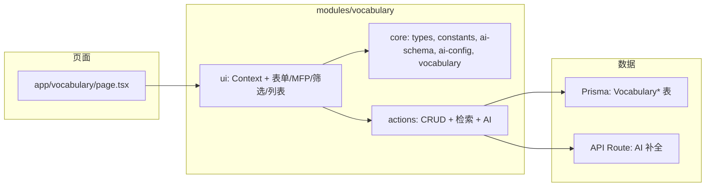

# 词汇学习页面实现方案

## 一、整体架构

- **路由与命名**：模块统一叫 vocabulary。路由路径与 app 目录一致为 **vocabulary**：
  - 路径：`/vocabulary`（在 `[modules/ui/pathnames.ts](modules/ui/pathnames.ts)` 中用 `vocabulary()`，不再使用 `words`）
  - 页面：`app/vocabulary/page.tsx`（新建；若保留 `app/words/page.tsx` 可改为重定向到 `/vocabulary`）
  - 导航：在 `[modules/ui/navbar.tsx](modules/ui/navbar.tsx)` 中增加「词汇」入口，链接到 `pathnames.vocabulary()`
- **模块划分**：`modules/vocabulary/` 与 `modules/corpus/` 平级，采用 **core / ui** 分层（对齐 [ai/code-style/microbleed/README.md](ai/code-style/microbleed/README.md)）：
  - **core/**：领域逻辑、与框架无关。含 `types.ts`（接口 I\* 命名）、`constants.ts`、`ai-schema.ts`、`ai-config.ts`、`vocabulary.ts`（IVocabulary 与列表/筛选状态形态）。Server Actions 仍在根目录 `actions.ts`。
  - **ui/**：React 仅做「用 core 的数据与能力渲染和交互」。通过 **VocabularyContext** 注入单一 **IVocabulary** 实例，子组件用 **useVocabulary()** 取实例并调用 setFilter、fetchEntries 等方法；入口组件 `vocabulary.tsx` 挂 Provider，FilterBar、WordList、EntryForm 等只订阅 Context 与调用方法。
- **语料库对齐**：单词列表的「筛选 + 搜索 + 分页」交互与语料库一致，便于后续扩展「记单词」功能时复用模式。

---

## 二、数据模型设计（Prisma，优化版）

在 `[prisma/schema.prisma](prisma/schema.prisma)` 中新增。**所有词汇业务相关表名均带 `Vocabulary` 前缀**，便于与语料库等其它业务区分。

### 2.1 语素表 VocabularyMorpheme（前缀/后缀/词根合一）

将原先三张结构相同的表合并为一张，用 `type` 区分，便于扩展与维护：

- **VocabularyMorpheme**（语素表）：`id`, `**type**`（`'prefix' | 'suffix' | 'root'`）, `text`（同一 type 下唯一，可 `@@unique([type, text])`）, `**meanings**`（JSON 数组 `string[]`，多个中文释义）。
- **VocabularyEntryMorpheme**（单词-语素关联）：`entryId`, `morphemeId`, `**role**`（`'prefix' | 'suffix' | 'root'`）。一个单词可有多条 `role='prefix'`、多条 `role='suffix'`，至多一条 `role='root'`；业务层约束「词根仅一条」，检索时按 `role` 过滤。

检索按 type/role 从 VocabularyMorpheme 反查单词；录入时从该表选或按 type 新建后再写 VocabularyEntryMorpheme。

### 2.2 分类表 VocabularyCategory

- **VocabularyCategory**：`id`, `name`（唯一）。预置 22 个分类（自然地理、植物研究、…、时间日期），便于外键约束与后台增删。
- **VocabularyEntry** 使用 `categoryId?` 外键关联 VocabularyCategory。

### 2.3 单词表 VocabularyEntry

- **VocabularyEntry**（词汇主表）
  - `id`, `**word**`（展示用）, `**wordLower**`（小写，**唯一**，用于去重与查询，避免 Apple/apple 重复）;
  - `phonetic?`, `**categoryId?**`（外键 VocabularyCategory）;
  - **词性 + 释义**：**JSON 字段** `meanings`，结构 `[{ partOfSpeech: string, meanings: string[] }]`;
  - **语素**：通过 **VocabularyEntryMorpheme** 关联 VocabularyMorpheme（多前缀、多后缀、一词根）;
  - **审计**：`createdAt`, `**updatedAt**`（便于最近修改与审计）。

### 2.4 词性筛选表 VocabularyEntryPartOfSpeech

- **VocabularyEntryPartOfSpeech**：`entryId`, `partOfSpeech`（如 `n.`、`v.`、`n.[C]` 等）。每条记录表示「该单词拥有该词性」；**写入或更新 VocabularyEntry 时，根据 `meanings` JSON 解析出所有 partOfSpeech，同步增删本表记录**，保证与 JSON 一致。检索按词性筛选时直接查本表并 join VocabularyEntry，走索引，性能更好。
- **索引**：`VocabularyEntryPartOfSpeech(partOfSpeech)`、`VocabularyEntryPartOfSpeech(entryId)`；可选 `@@unique([entryId, partOfSpeech])` 避免重复。

### 2.5 其它索引

- **VocabularyEntry**：`wordLower` 唯一；`categoryId`、`updatedAt`；
- **VocabularyEntryMorpheme**：`morphemeId`、`(entryId, role)`；
- **VocabularyMorpheme**：`(type, text)` 唯一、`type`。

### 2.6 常量与词性

- **词性 (partOfSpeech)**：在 `modules/vocabulary/core/constants.ts` 中定义常量数组，如 `n.` `v.` `vi.` `vt.` `adj.` `adv.` 等；名词可细分为 `n.[C]`/`n.[U]` 表示可数/不可数。
- **分类**：由 VocabularyCategory 表 seed 预置 22 条；`core/constants.ts` 中可保留列表供前端下拉与校验。

---

## 三、功能实现要点

### 1. MFP 学习视图（展示层）

- **M（Meaning）**：展示词性 + 对应释义列表；若「意思与词性不一致」需重点标记，首版可用简单启发式（例如：名词释义中出现典型动词结构时标出），或先做成「用户可手动标记」的字段，后续再接 AI 判断。
- **F（Form）**：展示前缀/前缀释义（多个）、后缀/后缀释义（多个）、词根/词根释义（多个），并可用简短文案说明「长相与意思的关系」。
- **P（Pronunciation）**：展示音标；若有「名前动后」等规则，可用说明文字或占位，后续再细化规则引擎。

**组件**：`VocabularyMfpCard`（或类似命名），接收一条 `VocabularyEntry`（含 `meanings` JSON 及通过 VocabularyEntryMorpheme 关联的 VocabularyMorpheme：前缀/后缀/词根），在单词列表里点击某词时，以 Modal / Drawer / 详情页形式展示，便于后续与「记单词」流程结合。

### 2. 用户录入表单

- **字段**：
  - 必填：单词（提交时同步写入 `word` 与 `wordLower`）
  - 选填：音标、词性+释义（对应 `meanings` JSON，写入时同步维护 VocabularyEntryPartOfSpeech）、**多个前缀/多个后缀/一个词根**（从 VocabularyMorpheme 表按 type 多选或新建，每条语素支持 **meanings 数组**）、分类（从 VocabularyCategory 表下拉 22 选 1）
- **表单形态**：词性+释义用「动态列表」序列化为 `meanings` JSON，提交时根据 partOfSpeech 同步写 VocabularyEntryPartOfSpeech。前缀/后缀/词根从 VocabularyMorpheme 按 `type` 选或新建（text + meanings[]），通过 VocabularyEntryMorpheme 关联并设置 `role`；词根在业务层限制为至多一条。
- **AI 补全按钮**：在单词输入框右侧放 AI 图标按钮；点击后根据当前输入的 `word` 调用后端「AI 补全」接口，将返回结果写回表单各字段（不自动提交，用户可编辑后再保存）。

### 3. AI 配置与补全接口

- **配置项**（放在设置里）：
  - 在现有设置入口（`[modules/ui/settings.tsx](modules/ui/settings.tsx)` 的 Modal）中增加「词汇 / AI」区域，或单独一个「AI 配置」折叠区。
  - 字段：`baseUrl`、`accessToken`、`model`（以及可选：超时、max_tokens 等）。
  - 持久化：当前项目未用 localStorage，建议用 **localStorage** 存上述配置（key 如 `vocabulary-ai-config`），避免把 key 写进代码；若后续要做多端同步再改为服务端或用户配置表。
- **调用方式**：
  - 前端不直接调外部 API（避免 CORS 与泄露 key）。新增 **Next.js API Route**（如 `POST /api/vocabulary/ai-fill`）：
    - Body：`{ word: string, baseUrl?, accessToken?, model? }`（若前端不传则用 `process.env` 的默认值，便于部署时用 env 统一管理）。
    - 该 Route 请求 OpenAI 兼容接口，prompt 要求返回 JSON：`{ phonetic, partOfSpeechMeanings: [{ partOfSpeech, meanings: string[] }], prefixes: [{ text, meanings: string[] }], suffixes: [{ text, meanings: string[] }], root: { text, meanings: string[] }, category }`（多前缀、多后缀、一词根，释义均为数组），前端提交时再写入 VocabularyMorpheme 表并建立 VocabularyEntryMorpheme 关联。
  - 前端：从 localStorage 读取配置，请求 `/api/vocabulary/ai-fill` 并把返回结果填回表单。

### 4. 单词列表与检索

- **检索字段**：与语料库类似，提供「筛选 + 搜索」：
  - 词性（多选，来自 **VocabularyEntryPartOfSpeech** 表，走索引）
  - 前缀、后缀、词根（多选，来自 **VocabularyMorpheme** 表按 `type` 过滤）
  - 分类（多选，来自 **VocabularyCategory** 表）
- **实现**：
  - Server Action：`getVocabularyEntries(filter)`，按筛选条件查 VocabularyEntry（关联 VocabularyEntryMorpheme + VocabularyMorpheme、VocabularyCategory、VocabularyEntryPartOfSpeech），分页返回（pageSize 可参考语料库）。
  - `getVocabularyFilterOptions()`：从 **VocabularyMorpheme** 按 type 取前缀/后缀/词根候选，从 **VocabularyEntryPartOfSpeech** 或常量取词性候选，从 **VocabularyCategory** 取分类列表，供筛选栏渲染。
- **列表展示**：表格或卡片列表，每行显示单词、音标、主要词性/释义、分类等；点击某行可进入 MFP 详情或侧边抽屉。

### 5. 导航与入口

- 在 `[modules/ui/navbar.tsx](modules/ui/navbar.tsx)` 中增加「词汇」入口，链接到 `pathnames.vocabulary()`（在 `[modules/ui/pathnames.ts](modules/ui/pathnames.ts)` 中提供 `vocabulary: () => "/vocabulary"`）。
- 页面入口为 `app/vocabulary/page.tsx`；若保留 `app/words/page.tsx` 可改为重定向到 `/vocabulary`，避免旧链接失效。
- 词汇页内 Tab 或区块划分建议：**录入** | **单词列表（含筛选）**；列表中点词进入 **MFP 详情**。后续「记单词」可再加 Tab 或入口。

---

## 四、文件与职责清单

| 类型           | 路径                                    | 说明                                                                                                                                                                                                                                                                                             |
| -------------- | --------------------------------------- | ------------------------------------------------------------------------------------------------------------------------------------------------------------------------------------------------------------------------------------------------------------------------------------------------ |
| Schema         | `prisma/schema.prisma`                  | VocabularyMorpheme（type, text, meanings Json）；VocabularyCategory（name）；VocabularyEntry（word, wordLower 唯一, meanings Json, categoryId, createdAt/updatedAt）；VocabularyEntryMorpheme（entryId, morphemeId, role）；VocabularyEntryPartOfSpeech（entryId, partOfSpeech）；索引见 2.4–2.5 |
| 常量           | `modules/vocabulary/core/constants.ts`  | 22 个分类（由 VocabularyCategory seed 提供时可作兜底）+ 词性列表（含 n.[C]/n.[U] 等）                                                                                                                                                                                                            |
| 类型           | `modules/vocabulary/core/types.ts`      | 入参、筛选项、表单、API 返回等 TS 类型（接口 I\* 命名，如 IVocabularyFilter、IVocabularyEntryFormData）                                                                                                                                                                                          |
| AI Schema      | `modules/vocabulary/core/ai-schema.ts`  | Zod 与 JSON Schema，用于 AI 补全/批量解析的结构化输出校验                                                                                                                                                                                                                                        |
| AI 配置        | `modules/vocabulary/core/ai-config.ts`  | VocabularyAiConfig、getStoredVocabularyAiConfig、saveVocabularyAiConfig（localStorage）                                                                                                                                                                                                          |
| 词汇实例形态   | `modules/vocabulary/core/vocabulary.ts` | IVocabulary、IVocabularyResult、IVocabularyAiConfig；供 UI 通过 Context 注入的实例形态约定                                                                                                                                                                                                       |
| Server Actions | `modules/vocabulary/actions.ts`         | CRUD 单词、getVocabularyEntries、getVocabularyFilterOptions、AI 补全/批量解析                                                                                                                                                                                                                    |
| API Route      | `app/api/vocabulary/ai-fill/route.ts`   | POST，调外部 LLM，返回结构化补全数据（含前缀/后缀/词根，可落表后关联）                                                                                                                                                                                                                           |
| 设置           | `modules/ui/settings.tsx`               | 增加 AI 配置项（baseUrl、accessToken、model），读写 localStorage                                                                                                                                                                                                                                 |
| Context        | `modules/vocabulary/ui/context.tsx`     | VocabularyContext、useVocabulary()、useVocabularyOptional()；UI 通过 useVocabulary() 取 IVocabulary 实例                                                                                                                                                                                         |
| 表单           | `modules/vocabulary/ui/entry-form.tsx`  | 录入/编辑表单 + AI 按钮；在词汇页从 Context 取 aiConfig/onSuccess/onError，在导入页通过 props 传入                                                                                                                                                                                               |
| MFP 卡片       | `modules/vocabulary/ui/mfp-card.tsx`    | 单词 MFP 展示                                                                                                                                                                                                                                                                                    |
| 筛选栏         | `modules/vocabulary/ui/filter-bar.tsx`  | 词性/前缀/后缀/词根/分类 + 搜索按钮；通过 useVocabulary() 取 filter、setFilter、fetchEntries 等                                                                                                                                                                                                  |
| 列表           | `modules/vocabulary/ui/word-list.tsx`   | 分页列表 + 点击看 MFP；通过 useVocabulary() 取 result、page、handlePageChange、handleRefresh 等                                                                                                                                                                                                  |
| 页面容器       | `modules/vocabulary/ui/vocabulary.tsx`  | 挂 VocabularyContext.Provider，构建 IVocabulary 形态的 state + 方法并注入，组合 EntryForm、FilterBar、WordList                                                                                                                                                                                   |
| 页面           | `app/vocabulary/page.tsx`               | 渲染词汇模块容器 + 标题                                                                                                                                                                                                                                                                          |

---

## 五、与语料库的差异与可复用点

- **语料库**：数据来自静态 JSON + CorpusChapter/CorpusTest/CorpusWord，筛选为 chapter/test/掌握状态/正确率等。
- **词汇**：数据来自 VocabularyEntry（meanings JSON、wordLower 唯一、VocabularyEntryMorpheme 关联 VocabularyMorpheme、VocabularyCategory、VocabularyEntryPartOfSpeech），筛选为词性/前缀/后缀/词根/分类（VocabularyMorpheme 按 type/role、VocabularyCategory、VocabularyEntryPartOfSpeech）；列表+分页+「点击看详情」的交互可复用语料库的 FilterBar + MainContent 的布局思路，具体组件独立实现以保持词汇域内聚。

---

## 六、后续扩展预留

- **记单词功能**：当前不实现，仅在数据与 UI 上预留：Entry 的 meanings JSON 已支持多词性多释义，MFP 卡片可被「复习流程」复用；列表筛选结果也可作为「本轮要背的词」的数据源。
- **Navbar 底部文案**：`[modules/ui/navbar.tsx](modules/ui/navbar.tsx)` 第 75–117 行有 22 条 Chapter 文案，与分类列表一致，可抽成共享常量（如 `VOCABULARY_CATEGORIES`）供 navbar 与 vocabulary 共用，避免重复维护。

---

## 七、实现顺序建议

1. Prisma 模型（VocabularyMorpheme、VocabularyCategory、VocabularyEntry、VocabularyEntryMorpheme、VocabularyEntryPartOfSpeech）+ 索引（见 2.4–2.5）+ migration；常量/类型（词性含 n.[C]/n.[U]）
2. Seed：VocabularyCategory 预置 22 个分类
3. Actions：VocabularyMorpheme 按 type 查询与创建；VocabularyCategory 列表；单词 CRUD（word/wordLower、meanings JSON、VocabularyEntryMorpheme、**VocabularyEntryPartOfSpeech 同步**）；getVocabularyFilterOptions（VocabularyMorpheme 按 type + VocabularyEntryPartOfSpeech + VocabularyCategory）；getVocabularyEntries（带筛选与分页）
4. API Route：`/api/vocabulary/ai-fill` + prompt 与 JSON 解析（返回 prefixes/suffixes/root 含 meanings 数组），前端提交时写入 VocabularyMorpheme 并建 VocabularyEntryMorpheme
5. 设置页：AI 配置项 + localStorage 读写
6. 表单组件：word/wordLower、动态词性/释义（提交时同步 VocabularyEntryPartOfSpeech）、多选前缀/后缀、单选词根（从 VocabularyMorpheme 按 type 选或新建）+ AI 按钮回填
7. MFP 卡片组件（展示 meanings + 通过 VocabularyEntryMorpheme 的前缀/后缀/词根）
8. 筛选栏（词性/前缀/后缀/词根/分类）+ 单词列表 + 分页，列表点击打开 MFP
9. 词汇页 `app/vocabulary/page.tsx` 组装 + pathnames.vocabulary() + 导航栏「词汇」入口

按此顺序可先打通「录入 → 列表 → 检索 → 查看 MFP」，再细化 M 的「意思与词性不一致」标记与 P 的规则说明。
